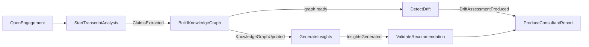

# Application Layer — Design

> **Status:** Design + contracts. The first cross-context orchestration layer,
> wiring the six domain contexts into platform use cases. **Contracts only** — no
> orchestration bodies, persistence, HTTP, or SDK usage. Lives in
> `apps/core-api/src/application/`. Placement + boundary rules: ADR-0008.

---

## 1. Architecture overview

The application layer sits **above** the bounded contexts and composes their
domain ports. It owns *coordination*, never domain truth.

```
          ┌──────────────────────────────────────────────────────────┐
          │  application/  (use cases · commands · queries · results)  │
          │   depends on: domain ports + Shared Kernel + AI ACL        │
          └───────────┬───────────────────────────────┬──────────────┘
        domain ports  │                                │  AI ACL port (only AI seam)
            ┌─────────▼─────────┐              ┌────────▼────────┐
            │ Transcript · Knowl│              │  AiEnginePort   │
            │ Insights · Org ·  │              │  + task ports   │──▶ (infra: Claude adapter, later)
            │ Drift  (domain)   │              └─────────────────┘
            └───────────────────┘
```

**Rules (ADR-0008):** depends on domain contracts only; no infrastructure
imports; all AI via the ACL; AI output is a DTO proposal mapped + validated before
becoming domain state; one handler per use case; every handler testable with
fakes.

**Contract vs implementation.** The files here are the *boundary*: commands,
queries, results, handler interfaces, application ports, application events, and
the AI ACL. Which domain repositories/policies each handler composes is listed in
§3 (the use-case map) and wired in the *implementation* — it is deliberately not
imported into the contract files, keeping the boundary kernel-only and clean.

---

## 2. Command / query list

| Kind | Name | In → Out |
|---|---|---|
| Command | `OpenEngagement` | `OpenEngagementCommand` → `OpenEngagementResult` |
| Command | `StartTranscriptAnalysis` ★ | `StartTranscriptAnalysisCommand` → `…Result` |
| Command | `ExtractClaimsFromTranscript` | `…Command` → `…Result` |
| Command | `BuildKnowledgeGraph` ★ | `BuildKnowledgeGraphCommand` → `…Result` |
| Command | `GenerateInsights` | `GenerateInsightsCommand` → `…Result` |
| Command | `DetectDrift` ★ | `DetectDriftCommand` → `…Result` |
| Command | `ProduceConsultantReport` | `…Command` → `…Result` |
| Command | `ValidateRecommendation` | `…Command` → `…Result` |

★ = the three priority use cases. Query handlers (`QueryHandler<Q,R>`) are
abstracted for the read side (dashboard/report queries over the contexts' read
models); no queries are materialized in this first slice.

---

## 3. Use-case map (which domain ports each handler composes)

| Use case | Reads | Writes | AI ACL | Key rules |
|---|---|---|---|---|
| OpenEngagement | Organization `OrganizationRepository` | Organization `EngagementRepository` | — | ORG7 scope |
| **StartTranscriptAnalysis** | Transcript `TranscriptRepository` + `TranscriptSegmentResolver` | Knowledge `ClaimRepository` | `ClaimExtractionPort` | evidence-first; AI→Proposed |
| ExtractClaimsFromTranscript | Transcript repos | Knowledge `ClaimRepository` | `ClaimExtractionPort` | C1 claims are Stated |
| **BuildKnowledgeGraph** | Knowledge `ClaimRepository` | Knowledge node/edge repos | `KnowledgeConstruction` (opt) | ADR-0006 eventual; N1/N3/N4 |
| GenerateInsights | Knowledge `KnowledgeGraphLens` | Insights repos | Bottleneck/Opportunity/Synthesis | INS1-3; AI→Proposed |
| **DetectDrift** | Organization repos + Knowledge lens | Drift repos | `MappingResolutionPort` | DRIFT1-8; hypothesis-until-validated |
| ProduceConsultantReport | Insights + Drift read models | (Reporting — future) | — | only `Validated` items |
| ValidateRecommendation | Insights `InsightsNodeRepository` | Insights `InsightsNodeRepository` | — | human-in-the-loop |

All writes run inside a `UnitOfWork`; graph writes are per-aggregate (never
graph-wide). Domain + application events publish after commit.

---

## 4. Ports & interfaces

**Use-case abstractions** (`shared/use-case.ts`): `UseCase<In,Out>`,
`CommandHandler`, `QueryHandler`, `Command`, `Query`, `ExecutionContext`
(scope + actor + correlationId + cancellation).

**Cross-cutting application ports** (`shared/ports.ts`):
- `UnitOfWork` / `TransactionScope` — transaction boundary (single-aggregate).
- `DomainEventPublisher` / `ApplicationEventPublisher` — outbox-friendly.
- `Clock` — deterministic time.
- `IdempotencyKey` / `IdempotencyStore` — replay-safe commands.
- `AuthorizationPort` / `AppAction` / `AuthorizationDecision` — the authz boundary.
- `CancellationToken` / `Deadline` — cancellation + timeout.

**AI ACL** (`ai/`): `AiEnginePort` (generic), `ClaimExtractionPort`,
`MappingResolutionPort` (task-specific), plus the request/response/error/retry
contracts (§7).

**Reused (not redefined):** every domain repository port and policy from the six
contexts, and the Shared Kernel `DomainEvent` / `Confidence` / `ValidationRecord`.

---

## 5. DTO contracts

- **Command/Result DTOs** — one pair per use case. Inputs carry Shared Kernel
  branded scope ids (`EngagementId`, `TranscriptId`, `OrganizationId`); results
  carry counts and *opaque string ids* for context-internal artifacts at the
  boundary (see seam #1).
- **AI proposal DTOs** (`ai/task-ports.ts`) — `ExtractedClaimDto`,
  `MappingSuggestionDto`, etc. Deliberately **not** domain objects: raw
  subject/predicate/object, spans, and *raw* confidence numbers. The handler maps
  them to domain candidates (`Proposed`) and re-anchors evidence before persisting.
- **Report DTOs** — `ConsultantReportSectionDto` (until the Reporting context
  exists).

---

## 6. Event flow



Each arrow is an **application event** (`events/application-events.ts`) plus the
domain events the underlying contexts emit. The application layer publishes both
after a successful `UnitOfWork` commit; downstream use cases are triggered by these
events (choreography), not by a central orchestrator.

---

## 7. AI boundary design

The AI Engine ACL (`ai/`) is the **only** path to an LLM. It defines:

| Concern | Contract |
|---|---|
| Model request | `AiRequest<TInput>` (taskType, input, optional `AiModelRef`, `AiInvocationParams`, correlationId, cancellation) |
| Structured output | `AiStructuredOutput<TOutput>` (output, confidence hint, model, usage, producedAt) |
| Result / error | `AiResult<T>` = success \| `AiEngineError` (`AiErrorKind`, `retryable`) |
| Retry | `RetryPolicy` (maxAttempts, backoff, retryableKinds) |
| Confidence metadata | `AiConfidenceHint` — **raw 0..1, not** domain `Confidence` |
| Validation hook | `AiOutputValidator<T>` — schema gate before return |
| Cancellation / timeout | `CancellationToken` + `Deadline` |
| Cost / tokens | `AiUsage` (input/output tokens, cost estimate) |

**The two gates that keep AI out of the domain:** (1) the ACL's
`AiOutputValidator` rejects malformed output; (2) the use case maps the DTO to a
domain candidate with `validation.state = 'Proposed'` and runs evidence-first
validation before persistence. Claude integration is **not** implemented — only
the boundary is defined; the adapter defaults to the latest Claude model when
`AiModelRef` is omitted.

---

## 8. Test strategy

- **Handlers are unit-testable with no infrastructure.** Inject fakes for every
  port (`AiEnginePort`, repositories, `UnitOfWork`, `Clock`, publishers,
  `AuthorizationPort`); assert the result and the emitted events.
- **AI is a fake, always.** Tests supply canned `AiResult`s — including error
  kinds — to exercise retry, `AiUnavailable`, and cancellation paths without a
  model.
- **Evidence-first is a test axis.** Feed `ExtractedClaimDto`s whose spans do *not*
  resolve against a fake segment resolver; assert they are rejected, never
  persisted.
- **AI-proposes-domain-validates is a test axis.** Assert every AI-derived artifact
  is persisted with `validation.state = 'Proposed'`, never `Validated`.
- **Idempotency + authorization** are table-tested: replayed `idempotencyKey`
  no-ops; denied `AuthorizationDecision` short-circuits to `Unauthorized`.
- **Determinism:** `Clock` and `IdGenerator`-equivalents (repo `nextIdentity`) are
  injected, so results are reproducible.

---

## 9. Seams to close before infrastructure work

1. **Published Languages don't export id VOs.** Result DTOs fall back to opaque
   `string` ids for context-internal artifacts (Claim/Assessment/Finding). Fix:
   each context's `published-language.ts` should export its id VOs so the
   application uses branded ids end-to-end. (Also felt by Drift.)
2. **No domain validation-transition service.** Aggregates are state-only
   contracts, so `ValidateRecommendation` assembles the `ValidationEvent` +
   `ValidationRecord` transition at the application boundary. Fix: promote a
   `ValidationTransitionService` into the relevant contexts (or the kernel) so the
   transition is domain behaviour, not orchestration.
3. **No shared provenance/derivation builder.** Turning AI DTOs into evidence-first
   domain objects (mapping raw hints → `Confidence`, building `Derivation` chains
   to `EvidenceRef`s) is re-described per use case. Fix: a kernel `ProvenancePolicy`
   / `DerivationFactory` port (flagged since Insights).
4. **No context application APIs yet.** Handlers reach into many contexts' domain
   ports directly. Acceptable now; as contexts grow, expose per-context application
   services so the orchestrator composes *those*, not raw domain internals.
5. **Reporting context is missing.** `ProduceConsultantReport` composes read models
   at the application level as a stopgap; it needs a real Reporting domain.
6. **Module-boundary enforcement is convention-only.** Add ESLint
   `no-restricted-imports` (or real package boundaries) so cross-context imports
   are forced through `published-language`, mechanically upholding ADR-0002.
7. **Shared business scales.** `RiskLevel` (and likely `Severity`) are now shared
   across contexts by import; promote them to the Shared Kernel under the rule of
   three.
