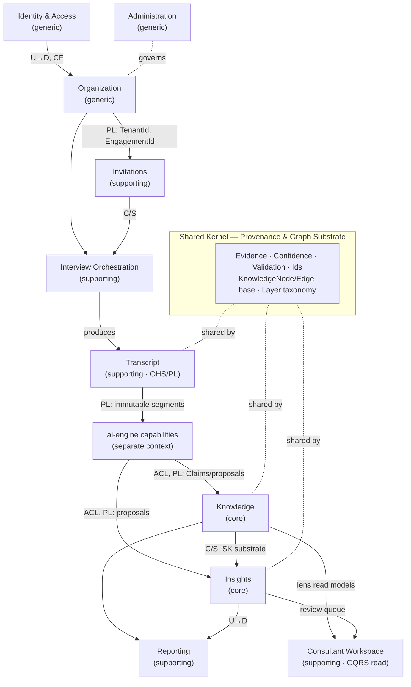
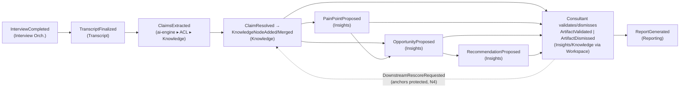

# Domain Model — DDD Skeleton

> **Status:** Design. Strategic + tactical Domain-Driven Design skeleton.
> **Contracts only — no implementation.** Signatures below are declarations
> (aggregate contracts, ports, event shapes), ready to be transcribed into
> `packages/contracts` and each context's `domain/` folder when implementation is
> approved. Notation is language-neutral pseudo-IDL: `«stereotype»`, `Type?` =
> optional, `Type[]` = collection, `A | B` = union. No method bodies appear
> anywhere by design.

This document defines **how the domain is decomposed and typed**. It sits on top
of `ARCHITECTURE.md` (runtimes & layering) and
`ORGANIZATIONAL_INTELLIGENCE_ENGINE.md` (what the knowledge *is*). Two principles
are load-bearing and every decision below preserves them:

- **One graph, six lenses** — a single unified property graph; the six "graphs"
  are typed layers over it (ADR-0004).
- **Evidence-first** — no node, edge, or insight exists without provenance; every
  inference resolves transitively to immutable transcript segments.

---

## 1. Strategic design: subdomains

Where we invest bespoke modeling effort vs. where we keep it standard.

| Subdomain type | Contexts | Rationale |
|---|---|---|
| **Core** (the moat) | **Knowledge**, **Insights** | The unified graph + diagnosis/opportunity/recommendation reasoning. This is the product. |
| **Supporting** | Transcript, Interview Orchestration, Invitations, Reporting, Consultant Workspace | Necessary, engagement-specific, but not the differentiator. |
| **Generic** | Identity & Access, Organization, Administration | Standard capabilities; model plainly, could be bought. |

The **AI cognition** runtime (`ai-engine`) is a **separate context** reached only
through published contracts + an Anti-Corruption Layer (§10). It never shares a
domain model with `core-api`.

---

## 2. Context Map

Relationship legend: **U→D** upstream→downstream · **SK** Shared Kernel · **PL**
Published Language · **C/S** Customer/Supplier · **CF** Conformist · **ACL**
Anti-Corruption Layer · **OHS** Open-Host Service.



**Key relationships explained**

- **Transcript is an Open-Host Service publishing a Published Language**: the
  immutable segment. `EvidenceRef` points here; nothing downstream may mutate it.
- **`ai-engine` → Knowledge/Insights is ACL + Published Language**: `ai-engine`
  proposes (Claims, candidate nodes, candidate pain points). Core-api's ACL
  translates proposals into domain objects and **enforces the evidence-first
  invariant at the boundary** — an evidence-less proposal is rejected, not stored.
- **Knowledge ↔ Insights share the Shared Kernel** substrate but own different
  node/edge *types* (§4). Insights is Customer to Knowledge's Supplier for the
  read model / lens queries.

---

## 3. The Shared Kernel — provenance + graph substrate

This is the smallest possible shared model that makes **evidence-first** and
**one-graph** uniform across every core context. It lives in `packages/contracts`
(cross-runtime) and a mirrored `core-api` shared-kernel module. Changes here
require agreement of all sharing contexts (that is the cost of a shared kernel,
accepted deliberately).

### 3.1 Identity & scope value objects
```
«vo» TenantId            // == OrganizationId
«vo» EngagementId        // graph scope
«vo» KnowledgeNodeId
«vo» KnowledgeEdgeId
«vo» ClaimId
«vo» TranscriptId · SegmentId
«vo» EvidenceId · DerivationId
«vo» ActorRef            // consultant | system-agent | interviewee, from IAM
```

### 3.2 Evidence primitives (the spine)
```
«enum» EvidenceKind = Stated | Corroborated | Inferred | ConsultantAsserted

«vo» CharSpan { start: int, end: int }              // invariant: 0 <= start <= end

«vo» EvidenceRef {                                   // points at immutable transcript
  transcriptId: TranscriptId
  segmentId: SegmentId
  span: CharSpan
  speaker: SourcePerspective
  utteredAt: Timestamp
}

«vo» SourcePerspective {                             // whose viewpoint — perspective-aware
  personRef: IntervieweeRef
  role: RoleLabel
  department: DepartmentLabel
}

«vo» ExtractionMethod { model: string, version: string, promptRef: string }

«vo» Derivation {                                    // how an INFERRED evidence was produced
  detectorId: string
  graphPattern: string
  inputEvidence: EvidenceId[]                        // invariant: non-empty, all resolvable in-engagement
  explanation: string
}

«vo» Evidence {
  id: EvidenceId
  kind: EvidenceKind
  anchor: EvidenceRef | Derivation                   // Stated/Corroborated → Ref; Inferred → Derivation
  certainty: SpeakerCertainty?                        // how strongly the source expressed it
  sentiment: Sentiment?
  method: ExtractionMethod?                            // present when machine-extracted
  createdAt: Timestamp                                 // append-only
}
```
**Shared-kernel invariant (E1):** `Evidence.kind = Inferred ⇒ anchor is Derivation`
whose `inputEvidence` is non-empty and every referenced evidence is itself
resolvable within the engagement → **transitive resolvability to Stated
segments.**

### 3.3 Confidence (computed, explainable, orthogonal to validation)
```
«vo» Score = decimal in [0,1]
«enum» ConfidenceBand = Low | Medium | High

«vo» ConfidenceFactors {
  extraction: Score · corroboration: Score · sourceAuthority: Score
  contradiction: Score · inferenceDepth: Score · humanValidation: Score
}
«vo» Confidence { score: Score, band: ConfidenceBand, factors: ConfidenceFactors, rationale: string }

«port» «domain-service» ConfidencePolicy {
  compute(factors: ConfidenceFactors) : Confidence
  recomputeOnEvidenceChange(current: Confidence, evidence: Evidence[]) : Confidence
}
```

### 3.4 Validation (the human-in-the-loop plane)
```
«enum» ValidationState =
  Proposed | ConsultantAdded | UnderReview | Validated | Edited | Dismissed

«vo» ValidationRecord {
  state: ValidationState
  isAnchor: bool                 // Validated/ConsultantAdded ⇒ true; protected from machine recompute
  lastEventId: ValidationEventId?
}

«entity» ValidationEvent {        // audit trail; owned by the artifact's context
  id: ValidationEventId
  actor: ActorRef
  action: ValidationState        // target state
  reason: string?
  before: ValidationState · after: ValidationState
  at: Timestamp
}
```

### 3.5 Graph substrate — the base contracts that make it ONE graph
```
«enum» Layer = Structural | Capability | Operational | Diagnostic | Opportunity | Synthesis

«abstract aggregate-root» KnowledgeNode {
  id: KnowledgeNodeId
  tenant: TenantId · engagement: EngagementId
  type: NodeType                 // discriminator (catalog per owning context)
  layers: Layer[]                // which lenses this node participates in
  label: Label
  attributes: NodeAttributes     // sealed hierarchy, per NodeType
  evidence: Evidence[]           // INV N1: size >= 1
  confidence: Confidence
  validation: ValidationRecord
  version: Version
  «behavior» attachEvidence(Evidence)                 // → NodeEvidenceAttached; recompute confidence
  «behavior» revise(NodeAttributes, Evidence)         // INV N4: blocked if validation.isAnchor
  «behavior» supersedeBy(KnowledgeNodeId)             // merge; preserves evidence → NodeMerged
  «behavior» applyValidation(ValidationEvent)         // → NodeValidated | NodeDismissed
}

«abstract aggregate-root» KnowledgeEdge {
  id: KnowledgeEdgeId
  tenant: TenantId · engagement: EngagementId
  type: EdgeType
  layers: Layer[]
  source: KnowledgeNodeId · target: KnowledgeNodeId   // references by IDENTITY (aggregate rule)
  attributes: EdgeAttributes
  evidence: Evidence[]           // INV N1
  confidence: Confidence
  validation: ValidationRecord
  «behavior» attachEvidence(Evidence)
  «behavior» applyValidation(ValidationEvent)
}
```
```
«port» «repository» KnowledgeNodeRepository {          // ONE physical graph store, tenant+engagement scoped
  findById(TenantId, EngagementId, KnowledgeNodeId) : KnowledgeNode?
  save(KnowledgeNode) : void
  findByType(EngagementId, NodeType) : KnowledgeNode[]
  findByLayer(EngagementId, Layer) : KnowledgeNode[]   // ← a LENS
  nextIdentity() : KnowledgeNodeId
}
«port» «repository» KnowledgeEdgeRepository {
  findById(TenantId, EngagementId, KnowledgeEdgeId) : KnowledgeEdge?
  save(KnowledgeEdge) : void
  outgoing(KnowledgeNodeId, EdgeType?) : KnowledgeEdge[]
  incoming(KnowledgeNodeId, EdgeType?) : KnowledgeEdge[]
  findByLayer(EngagementId, Layer) : KnowledgeEdge[]   // ← a LENS
}
«port» «read-model» KnowledgeGraphLens {               // Open-Host read side (see §4, §9)
  lens(EngagementId, Layer) : SubGraph
  subgraph(root: KnowledgeNodeId, depth: int) : SubGraph
  pathsBetween(a: KnowledgeNodeId, b: KnowledgeNodeId) : Path[]
  provenanceChain(nodeOrEdgeId) : EvidenceTree        // drill to Stated segments
}
```
**Substrate invariants**
- **N1 (evidence-first):** every node & edge has `evidence.size ≥ 1`.
- **N2 (scope):** node/edge carry the resolving request's `TenantId` +
  `EngagementId`; repositories forbid cross-scope reads (ADR-0003 guard).
- **N3 (endpoint integrity):** an edge's `source`/`target` nodes exist in the
  same engagement.
- **N4 (anchor protection):** if `validation.isAnchor`, machine recompute may not
  `revise`/overwrite — only a `ValidationEvent` can change it.
- **N5 (type↔layer coherence):** a node's `layers` are consistent with its
  `NodeType` (enforced by the owning context's factory).

---

## 4. Reconciling "one graph, six lenses" with context ownership

The crux. **Physically one graph; logically owned per layer.**

- The **Shared Kernel** (§3.5) owns the *base* `KnowledgeNode`/`KnowledgeEdge`
  contracts, the `Layer` taxonomy, the substrate repository ports, and the
  `KnowledgeGraphLens` read model. This is the single physical graph.
- Each **core context owns the node/edge _types_ (the `NodeType`/`EdgeType`
  catalog + sealed `NodeAttributes`/`EdgeAttributes` + invariants + lifecycle)**
  for its layer(s):

| Layer(s) | Owning context | Node types | Edge types |
|---|---|---|---|
| Structural, Capability, Operational | **Knowledge** | Department, Team, Role, Person, Process, Capability, Workflow, Activity, Handoff, System, Artifact | reports-to, part-of, owns, realized-by, has-step, precedes, performed-by, uses, produces, hands-off-via, collaborates-with |
| Diagnostic, Opportunity, Synthesis | **Insights** | PainPoint, Opportunity, Recommendation | affects, caused-by, blocks, addresses, applies-to, requires, enabled-by, bundles, targets, depends-on |

Because every type conforms to the Shared Kernel base contract, the graph is
**physically unified and cross-layer-queryable** (a lens is a `findByLayer`), while
each context keeps **sovereignty over its types' invariants and lifecycle**.
Insights authors its nodes into the same store via the shared substrate ports; it
does **not** run a second graph. That is how "one graph, six lenses" survives
bounded-context decomposition.

> **Refinement (surfaced while building the Knowledge context, applied to the
> Shared Kernel):** the node/edge type discriminant is carried by
> `attributes.nodeType` / `attributes.edgeType` (a single source of truth), and
> `NodeType`/`EdgeType` are **open string seams** narrowed by each context to a
> literal union (e.g. Knowledge's `'Department' | 'Workflow' | …`). `NodeAttributes`
> is generic over that literal, so a context's attribute set is a
> *self-discriminating* union while still conforming to the one base contract. See
> ADR-0005 and `@oi/contracts`.

---

## 5. Package structure (per context)

Consistent across `core-api` modules (mirrors the ratified skeleton). `ai-engine`
capabilities use the same names in Python.

```
apps/core-api/src/modules/<context>/
├── domain/
│   ├── aggregates/        # aggregate roots + their entities
│   ├── entities/          # non-root entities
│   ├── value-objects/     # VOs (immutable)
│   ├── repositories/      # «port» repository interfaces (contracts, no impl)
│   ├── services/          # «domain-service» ports + pure domain policies
│   ├── events/            # domain event definitions
│   └── invariants/        # invariant/specification declarations
├── application/           # use-case orchestration (later)
├── infrastructure/        # adapters incl. ACL to ai-engine (later)
└── presentation/          # controllers/DTOs (later)

packages/contracts/        # cross-runtime published language:
                           #   shared kernel VOs, node/edge base, Claim, event schemas
```
Only `domain/` and `packages/contracts/` are populated by this skeleton (as
contracts). `application/infrastructure/presentation` stay empty until build.

---

## 6. Core contexts (deep)

### 6.1 Knowledge (core) — the substrate + descriptive layers

**Purpose:** own the unified graph store contract and the Structural / Capability
/ Operational layers — the descriptive model of how the org actually works. Turn
resolved claims into nodes/edges.

**Aggregates & roots**
- `KnowledgeNode` (root; Knowledge's node types) — see §3.5 base.
- `KnowledgeEdge` (root; Knowledge's edge types).
- `Claim` (root) — the atomic text→graph bridge, pre-resolution.

```
«aggregate-root» Claim {
  id: ClaimId · tenant · engagement
  subjectPhrase: string · predicate: string · objectPhrase: string
  targetLayer: Layer
  evidence: Evidence                 // the segment it came from (INV: kind=Stated)
  extractionConfidence: Score
  status: Unresolved | Resolved | Rejected
  resolvedInto: (KnowledgeNodeId | KnowledgeEdgeId)[]?
  «behavior» resolveInto(ids)        // → ClaimResolved
  «behavior» reject(reason)          // → ClaimRejected
}
```

**Value objects:** `NodeType` (structural/capability/operational catalog),
`EdgeType`, `Layer`, sealed `NodeAttributes` hierarchy
(`DepartmentAttributes`, `WorkflowAttributes`, `ActivityAttributes` {actor,
effort, manualVsAuto, reworkRate}, `HandoffAttributes` {fromActor, toActor,
channel, latency, waitTime}, `SystemAttributes`, `ArtifactAttributes`, …),
`Label`, `Version`.

**Repositories (ports):** `KnowledgeNodeRepository`, `KnowledgeEdgeRepository`,
`ClaimRepository`, and read model `KnowledgeGraphLens` (all §3.5-shaped).

**Domain services (ports/policies)**
```
«domain-service» EntityResolutionPolicy {             // coreference / linking rules
  matchCandidates(Claim, existing: KnowledgeNode[]) : ResolutionDecision
}
«domain-service» EvidenceMergeService {               // combine evidence on merge; feeds ConfidencePolicy
  merge(a: Evidence[], b: Evidence[]) : Evidence[]
}
«domain-service» GraphConstructionService {           // promote resolved claims → nodes/edges
  construct(resolved: Claim[]) : GraphMutation         // enforces N1..N5
}
«domain-service» AnchorProtectionPolicy {             // N4 gate for recompute
  mayOverwrite(node|edge, proposedChange) : bool
}
```

**Domain events:** `ClaimResolved`, `ClaimRejected`, `KnowledgeNodeAdded`,
`KnowledgeNodeMerged`, `KnowledgeNodeRevised`, `NodeEvidenceAttached`,
`KnowledgeEdgeAdded`, `NodeConfidenceRecomputed`, `ContradictionDetected`,
`NodeValidated`, `NodeDismissed`.

**Invariants:** N1–N5 (§3.5), plus **K1** merge preserves identity + unions
evidence (never loses provenance); **K2** contradictions are recorded
(`ContradictionDetected`), never silently resolved; **K3** a `Claim` may only
resolve into nodes/edges within its engagement.

**Relationships:** Supplier to Insights (substrate + lens). Downstream of
`ai-engine` extraction/construction via ACL. Downstream of Transcript (evidence).

---

### 6.2 Insights (core) — diagnosis, opportunity, synthesis + validation

**Purpose:** own the Diagnostic / Opportunity / Synthesis layers and the
consultant validation workflow. Detect pain, match opportunities, synthesize
recommendations — authoring nodes/edges into the shared graph.

**Aggregates & roots** (each is a `KnowledgeNode` subtype *and* an Insights
aggregate — it lives in the shared graph but its invariants/lifecycle are here)
```
«aggregate-root» PainPoint : KnowledgeNode {
  category: People | Process | Technology              // INV P1: required
  severity: Severity · frequency: Frequency
  nature: Symptom | RootCause
  origin: Stated | Inferred
  // affects/caused-by/blocks edges author separately as KnowledgeEdge
  «behavior» reclassify(category, Evidence)            // consultant edit path
}
«aggregate-root» Opportunity : KnowledgeNode {
  aiPattern: AiPattern                                 // from taxonomy VO
  expectedImpact: Impact · feasibility: Feasibility · risk: Risk
  prerequisites: Prerequisite[]                        // data/integration/volume
  // INV O1: must have >=1 `addresses`→PainPoint AND >=1 `applies-to`→Activity/Workflow
  «behavior» attachPrerequisite(Prerequisite, Evidence)
}
«aggregate-root» Recommendation : KnowledgeNode {
  title: string · narrative: string
  horizon: QuickWin | NearTerm | Strategic
  priority: PriorityScore                              // from PrioritizationPolicy
  risks: Risk[] · dependencies: RecommendationId[]
  // INV R1: bundles >=1 Opportunity (via `bundles` edges)
  «behavior» reprioritize(PrioritizationPolicy)
}
```

**Value objects:** `AiPattern` (taxonomy: document-extraction | classification |
drafting | routing-triage | forecasting | retrieval-qa | rules-rpa |
anomaly-detection | …), `Severity`, `Frequency`, `Impact`, `Effort`,
`Feasibility`, `Risk`, `Prerequisite`, `PriorityScore`, `Horizon`,
`PainCategory`.

**Repositories (ports):** reuse substrate `KnowledgeNodeRepository`/`EdgeRepository`
(shared graph); plus Insights read models `PainPointRepository`,
`OpportunityRepository`, `RecommendationRepository` (typed views/filters over the
substrate), and `ReviewQueueRepository` (validation work).

**Domain services (ports/policies)**
```
«domain-service» BottleneckDetectionPolicy {          // graph pattern → PainPoint proposals
  detect(graph: KnowledgeGraphLens, engagement) : PainPointProposal[]
}
«domain-service» OpportunityMatchingPolicy {          // pain + workflow → Opportunity proposals
  match(painPoints, graph, taxonomy: AiPattern[]) : OpportunityProposal[]
}
«domain-service» RecommendationSynthesisService {     // bundle opportunities
  synthesize(opportunities) : RecommendationDraft[]
}
«domain-service» PrioritizationPolicy {               // Strategy: impact×feasibility÷effort × weights
  prioritize(RecommendationDraft, weights: StrategicWeights) : PriorityScore
}
«domain-service» ValidationWorkflowService {          // state machine transitions + audit + feedback
  transition(artifactId, ValidationEvent) : ValidationOutcome
}
```

**Domain events:** `PainPointProposed`, `PainPointReclassified`,
`OpportunityProposed`, `RecommendationProposed`, `RecommendationReprioritized`,
`ArtifactValidated`, `ArtifactEdited`, `ArtifactDismissed`,
`DownstreamRescoreRequested` (dismissal cascade).

**Invariants:** P1 (pain category required), O1 (opportunity must link pain +
work), R1 (recommendation bundles ≥1 opportunity), plus **I1**: AI-authored
artifacts start `Proposed`, never presented as fact; **I2**: dismissing a
PainPoint emits `DownstreamRescoreRequested` for dependent Opportunities/
Recommendations (human judgment propagates); **I3**: every Insights node still
obeys shared N1 (evidence-first) — an Opportunity's evidence includes the
Derivation over the pain + workflow it rests on.

**Relationships:** Customer of Knowledge (reads lens, authors nodes). Downstream
of `ai-engine` detection/synthesis via ACL. Supplier to Reporting + Consultant
Workspace.

---

## 7. Supporting & generic contexts (concise)

Each: **root aggregate(s) · key VOs · repositories · domain services · events ·
invariants · relationship**.

### 7.1 Transcript (supporting · Open-Host Service / Published Language) — the evidence source of truth
- **Aggregate:** `Transcript` (root, **append-only**) containing `Segment`
  entities.
- **VOs:** `TranscriptId`, `SegmentId`, `CharSpan`, `SpeakerRef`, `SegmentText`,
  `Timestamp`.
- **Repos:** `TranscriptRepository`, `SegmentReadRepository`.
- **Services:** `SegmentationPolicy` (port).
- **Events:** `TranscriptFinalized`, `SegmentIndexed`.
- **Invariants:** **T1** finalized transcript is immutable; **T2** segment ids +
  spans are stable forever (every `EvidenceRef` depends on this); **T3** segments
  ordered, contiguous.
- **Relationship:** OHS publishing the segment as Published Language; upstream to
  every evidence consumer. *This is the anchor the evidence-first invariant rests
  on.*

### 7.2 Interview Orchestration (supporting)
- **Aggregate:** `InterviewSession` (root) containing ordered `Turn` entities.
- **VOs:** `SessionId`, `TurnId`, `SessionState` (Scheduled|InProgress|Paused|
  Completed|Abandoned), `Utterance`, `ConversationContextRef`.
- **Repos:** `InterviewSessionRepository`.
- **Services:** `InterviewCognitionPort` (ACL→ai-engine), `ConversationMemoryPort`.
- **Events:** `InterviewStarted`, `TurnRecorded`, `InterviewCompleted`.
- **Invariants:** turns append-only & ordered; session bound to an accepted
  `Invitation` + `EngagementId`; `InterviewCompleted` ⇒ hand raw material to
  Transcript for finalization.
- **Relationship:** consumes ai-engine cognition via ACL; produces Transcript
  input.

### 7.3 Invitations (supporting)
- **Aggregate:** `Invitation` (root).
- **VOs:** `InvitationId`, `InviteToken` (single-use), `InviteStatus`
  (Pending|Sent|Accepted|Expired|Revoked), `IntervieweeRef`.
- **Repos:** `InvitationRepository`.
- **Services:** `InviteTokenPolicy` (issue/expire/verify).
- **Events:** `EmployeeInvited`, `InvitationAccepted`, `InvitationExpired`,
  `InvitationRevoked`.
- **Invariants:** token single-use + time-boxed; ≤1 active invitation per
  (engagement, employee).
- **Relationship:** downstream of Organization; Customer/Supplier to Interview
  Orchestration.

### 7.4 Reporting (supporting)
- **Aggregate:** `Report` (root) containing `ReportSection` entities.
- **VOs:** `ReportId`, `ReportStatus` (Draft|Generated|Published),
  `ProvenanceAppendix`.
- **Repos:** `ReportRepository`.
- **Services:** `ReportAssemblyService`.
- **Events:** `ReportGenerated`, `ReportPublished`.
- **Invariants:** **REP1** a report includes an insight only if `Validated`, or
  renders it explicitly flagged as unvalidated; **REP2** every included assertion
  carries its provenance drill-path (evidence-first end to end).
- **Relationship:** Conformist to Insights + Knowledge.

### 7.5 Consultant Workspace (supporting · CQRS read side)
- **Aggregate:** thin — `ReviewQueue` / `LensView` are **read models/projections**;
  validation *commands* delegate to Insights/Knowledge.
- **VOs:** `ReviewQueueItem`, `LensSelector(Layer)`, `ProvenanceView`.
- **Repos:** read-side query ports over `KnowledgeGraphLens`.
- **Services:** `ReviewQueueProjection` (builds from domain events).
- **Events:** consumes graph/insight events; the *command* it triggers surfaces as
  Insights' `ArtifactValidated`/`ArtifactDismissed`.
- **Invariants:** read-only over the graph; never mutates nodes directly — all
  changes go through owning contexts' behaviors (preserves invariants).
- **Relationship:** downstream read model of Knowledge + Insights.

### 7.6 Organization (generic/core-config)
- **Aggregates:** `Organization` (tenant root), `OrgUnit` (**official** structure
  tree), `Employee` (**official** directory), `Engagement` (root, graph scope).
- **VOs:** `OrganizationId`(=TenantId), `EngagementId`, `EngagementStatus`
  (Draft|Active|Ingesting|Frozen|Closed), `OrgUnitId`, `EmployeeId`,
  `OfficialStructure`.
- **Repos:** `OrganizationRepository`, `EngagementRepository`, `EmployeeRepository`.
- **Services:** `EngagementLifecyclePolicy`.
- **Events:** `OrganizationOnboarded`, `EngagementStarted`, `EngagementFrozen`,
  `EngagementClosed`.
- **Invariants:** engagement belongs to exactly one org; **official** structure
  here is the *baseline* deliberately contrasted against the **discovered**
  Department nodes in Knowledge (divergence = an Insights signal).
- **Relationship:** upstream Published Language (`TenantId`, `EngagementId`) to
  all; provides the ground-truth baseline.

### 7.7 Identity & Access (generic)
- **Aggregates:** `UserAccount` (root), `Session`.
- **VOs:** `UserId`, `Email`, `Credential`, `Role` (Consultant|OrgAdmin|
  PlatformAdmin|Interviewee), `Permission`, `ActorRef`.
- **Repos:** `UserAccountRepository`, `SessionRepository`.
- **Services:** `AuthenticationPort`, `AuthorizationPolicy`.
- **Events:** `UserRegistered`, `UserAuthenticated`, `SessionRevoked`.
- **Invariants:** unique email; role→permission mapping is authoritative; every
  domain mutation elsewhere carries a resolved `ActorRef`.
- **Relationship:** upstream generic; other contexts are Conformist consumers of
  `ActorRef`/`Role`.

### 7.8 Administration (generic)
- **Aggregates:** `TenantConfiguration`, `FeatureFlag`, `UsageRecord`.
- **VOs:** `FlagKey`, `Quota`, `UsageMetric`.
- **Events:** `FeatureToggled`, `QuotaExceeded`.
- **Relationship:** governs Organization/tenant config; cross-cutting.

---

## 8. Cross-context domain event flow (the pipeline as choreography)

The reasoning pipeline (`ORGANIZATIONAL_INTELLIGENCE_ENGINE.md` §12) is realized
as **event choreography** between contexts — no orchestrating god-service.



Each edge is a published domain event; every arrow preserves N1 (evidence-first)
and N4 (anchor protection) — validation never destroys machine output, and
recompute never overwrites a validated anchor.

---

## 9. `ai-engine` capabilities as ACL'd domain-service ports

From `core-api`'s domain, each `ai-engine` capability is a **domain-service port**
implemented by an **Anti-Corruption Layer adapter** (in `infrastructure/`, built
later) that speaks the `packages/contracts` Published Language.

```
«port» ExtractionService        { extract(segment) : ClaimProposal[] }        // → Knowledge
«port» KnowledgeConstruction    { resolve(claims) : ResolutionProposal }      // → Knowledge
«port» BottleneckDetection      { detect(lens) : PainPointProposal[] }        // → Insights
«port» OpportunityDetection     { match(lens, pains) : OpportunityProposal[] }// → Insights
«port» RecommendationSynthesis  { synthesize(opps) : RecommendationDraft[] }  // → Insights
«port» InterviewCognition       { nextTurn(context) : TurnProposal }          // → Interview Orch.
«port» ConversationMemory       { compact(context) : ConversationContextRef } // → Interview Orch.
```
**ACL contract law:** proposals are DTOs, never domain objects. The adapter
translates a proposal into a domain object **only after** validating N1 — a
proposal lacking resolvable evidence is rejected at the boundary. `ai-engine`'s
internal model never enters `core-api`'s domain.

---

## 10. Consolidated global invariants (the non-negotiables)

| # | Invariant | Enforced where |
|---|---|---|
| **G1 Evidence-first** | No node/edge/insight without ≥1 `Evidence` (N1); inferred evidence transitively resolves to Stated segments (E1). | Shared Kernel + every context factory + the ACL. |
| **G2 One graph** | All node/edge types conform to the shared substrate; a lens is `findByLayer`; no context runs a second graph. | Shared Kernel; §4 ownership rule. |
| **G3 Tenant + engagement scope** | Every artifact scoped; repositories forbid cross-scope reads. | Repo guard (ADR-0003). |
| **G4 AI proposes, human disposes** | AI artifacts start `Proposed`; validation is explicit + audited. | Insights `ValidationWorkflowService`. |
| **G5 Anchor protection** | Recompute never overwrites a `Validated`/`ConsultantAdded` anchor. | `AnchorProtectionPolicy` (N4). |
| **G6 Immutable evidence** | Transcripts/segments append-only; evidence append-only. | Transcript (T1–T3). |
| **G7 Provenance to the boardroom** | Every reported insight drills to transcript segments. | Reporting REP2 + `KnowledgeGraphLens.provenanceChain`. |

---

## 11. Deliberately deferred (needs a call before build)

1. ~~**Aggregate granularity of the graph.**~~ **Ratified (ADR-0006):** each
   `KnowledgeNode` and `KnowledgeEdge` is its own Aggregate Root; graph-wide
   operations are eventually consistent.
2. ~~**Where `Engagement` lives.**~~ **Ratified (ADR-0007):** `Engagement` is an
   aggregate inside the Organization bounded context.
3. **Insights read models vs. materialized types.** `PainPointRepository` et al.
   as filtered views over the substrate vs. materialized projections — a
   persistence concern, decided with the store (deferred, behind ports).
4. **AiPattern taxonomy ownership** — domain-owned vs. firm-extensible (open from
   the engine design §15).
5. **Event transport** — in-process domain events vs. a broker for the async
   boundary (deferred per ARCHITECTURE §9).
