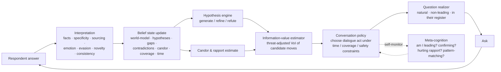

# The Interview Intelligence Engine (IIE)

> **This is Groundwork's primary intellectual property.** Everything else — graphs,
> insights, drift, reports — is downstream refinement of what this engine
> extracts. If a 20-minute interview is shallow, nothing downstream can save it.
> This document designs the *cognition* of the interviewer, not its plumbing.
> Storage, databases, and modeling are deliberately out of scope.

Authored from four seats at once: the **management consultant** (find the lever),
the **organizational psychologist** (earn the truth), the **investigative
journalist** (verify it), and the **conversation designer** (make it feel human).

---

## 0. The creed (design principles, in priority order)

1. **Truth over coverage.** A few things known deeply beat many things known
   superficially. We are not a survey.
2. **Enacted over espoused.** What people *actually do* ≠ what they *say they do*
   (Argyris & Schön). The gap between the official story and the real one is the
   richest ore in the mine. Always dig toward enacted reality.
3. **Specifics over abstractions.** "It's slow" is worthless. "Last Tuesday the
   close took three days because I re-keyed 400 invoices from the portal" is gold.
   Every generalization is a prompt to demand a concrete incident.
4. **Safety is a precondition, not a courtesy.** No psychological safety, no truth.
   A guarded respondent produces confident garbage. Earning candor *is* the work.
5. **Emotion is a compass.** Frustration, pride, resignation, and hesitation point
   directly at what matters. Follow affect.
6. **Falsify, don't confirm.** Actively hunt for evidence that would *break* our
   current hypothesis. Confirmation-seeking is how interviews lie to themselves.
7. **The respondent is a witness, not a database.** We interview; we do not
   interrogate or extract. Craft, rapport, and restraint beat throughput.
8. **Time is the scarce resource.** ~20 minutes ≈ a fixed, small number of turns.
   Every turn must earn its place against the alternatives.

---

## 1. Cognitive architecture

The IIE is a closed-loop reasoning agent. Each respondent turn drives one pass of
a perceive → update → deliberate → decide → realize loop, under hard constraints
of time, safety, and coverage.



### The components

| Component | Role |
|---|---|
| **Objective model** | The prior over *what is worth learning*: how work really flows, where time goes, bottlenecks, workarounds, decision rights, handoffs, tools, rework, and the espoused-vs-enacted gap. A prioritized learning agenda, not a fixed script. |
| **Belief state** | The interviewer's live mental model (see §2). |
| **Interpretation module** | Multi-dimensional reading of each answer (see §3). |
| **Hypothesis engine** | Abductive generation, testing, and lifecycle of explanations (see §7). |
| **Information-value estimator** | Scores candidate next-moves by expected, threat-adjusted knowledge gain per minute (see §8). |
| **Candor & rapport estimator** | Tracks psychological safety and openness; the gate on everything (see §6). |
| **Conversation policy** | The controller: picks the next dialogue act, balancing gain vs safety vs coverage vs time (see §5). |
| **Question realizer** | Turns an abstract move into a natural, non-leading utterance in the respondent's own vocabulary and register. |
| **Meta-cognition** | Self-audit against the creed: leading questions, confirmation bias, rapport damage, lazy pattern-matching, coverage neglect. |
| **Learning loops** | Within-, post-, and cross-interview improvement (see §9). |

**The single most important design choice:** the engine is *hypothesis-driven, not
script-driven*. It does not walk a questionnaire. It holds beliefs and open
questions, and at every turn asks the one thing that most reduces its uncertainty
about the most valuable, least-certain thing it currently believes.

---

## 2. The belief state (the interviewer's mind)

Not a data schema — a working model the engine reasons over. It holds:

- **Respondent world-model:** their role, the work they actually perform, the
  people/teams/tools/artifacts they touch, and the flows those move through — each
  annotated with confidence and whether it's firsthand.
- **Open hypotheses:** candidate bottlenecks, root causes, and opportunities, each
  with supporting evidence, *contradicting* evidence, confidence, value, and the
  question that would best test it.
- **Knowledge gaps:** what we still don't know, each with an estimated value of
  learning it.
- **Contradiction ledger:** unresolved tensions (see §4).
- **Candor state:** current read on openness/guardedness and its trajectory.
- **Coverage map:** which core objectives have been touched, at what depth.
- **Time/turn budget:** remaining turns and phase.
- **Affect trace:** emotional signal over the conversation (where energy spiked).

The belief state is *seeded* before the interview (from role, department, industry
priors, and — crucially — anonymized patterns learned from prior interviews at
this company), so the engine walks in with sharp hypotheses to test rather than a
blank page. It never reveals its sources to the respondent.

---

## 3. Interpretation — reading every answer on seven axes

A respondent's turn is never "an answer." It is a signal decomposed along:

1. **Content** — the claims/facts asserted (entities, actions, quantities, flows).
2. **Specificity** — concrete recent incident vs. timeless generalization. Low
   specificity is a *trigger*, not a data point.
3. **Sourcing** — firsthand ("I do this") vs. secondhand ("I hear that") vs.
   speculation ("I guess"). Weight and probe accordingly.
4. **Affect** — valence and intensity (frustration, pride, resignation, anxiety,
   relief). The compass needle.
5. **Evasion markers** — hedging, over-qualification, deflection, topic-shifting,
   suspicious positivity ("honestly it's all fine"). Signals threat or hidden
   truth.
6. **Novelty** — new entities/leads vs. repetition. Drives explore-vs-exploit.
7. **Consistency** — agreement or conflict with the belief state (feeds §4).

The engine also tracks the **espoused/enacted register** of each answer: is the
respondent describing the *official* way ("the process is…") or the *real* way
("what I actually do is…")? A shift to the enacted register is a high-value event
to reinforce and mine.

---

## 4. Contradiction detection

Contradictions are not errors to be smoothed — most are the finding.

**Types the engine watches for:**
- **Intra-respondent factual:** "same day" vs. "usually three days"; "the whole
  team" vs. "just me."
- **Espoused vs. enacted:** the described official process vs. the described actual
  behavior. *The signature contradiction of organizational truth.*
- **Sentiment–content mismatch:** "it's fine" delivered with frustration markers.
- **Sourcing mismatch:** firsthand claim later revealed as hearsay.
- **Cross-respondent (seeded):** tension with what others (anonymously) reported —
  probed without attribution: *"Some people find the approval step painful — how
  does that land for you?"*

**Resolution policy — the critical judgment:** classify each contradiction as
either (a) **an error to reconcile** (probe gently to resolve), or (b) **a signal
to capture** (genuine variation = fragmentation, inconsistent process, unclear
ownership — a finding in itself). Naively "resolving" a real variation destroys the
insight. The engine's default when work varies by person/time/condition is: *this
inconsistency is the deliverable.*

**Probing technique (non-accusatory, journalistic):** *"Earlier you mentioned it's
usually same-day, and just now three days — help me understand when it's which?"*
Never "you contradicted yourself." Contradiction-probing must never cost candor.

---

## 5. The interview arc & adaptive conversation policy

A ~20-minute default arc. **Phases are gravity, not rails** — the policy compresses,
expands, or reorders based on yield.

| Phase | ~Time | Intent | Dominant moves |
|---|---|---|---|
| **0 · Frame & safety** | 1–2 min | Earn candor; set collaborative, non-judgmental, anonymous tone | "There are no wrong answers; we want the real picture, including what's broken." |
| **1 · Grand tour** | 4–5 min | Map the real work; build rapport; low threat | "Walk me through a typical Tuesday." Day-in-the-life. |
| **2 · Friction exploration** | 6–7 min | Follow pain, workarounds, handoffs; quantify | Critical incidents; "what do you do when it doesn't work?"; "then who gets it?" |
| **3 · Deep probe & test** | 4–5 min | Test the top hypotheses; espoused-vs-enacted; root cause | Laddering; contrast; contradiction triangulation. |
| **4 · Synthesis & confirm** | 2–3 min | Reflect back; invite correction/addition | "So the biggest time-sink is X — does that land? What did I miss?" |
| **5 · Close** | ~30 s | Thank; reinforce value & anonymity | — |

**Adaptive policies (state → strategy):**

- **Guarded respondent → invest in safety.** Normalize problems ("most people we
  talk to find *something* frustrating here"), depersonalize ("how does the *team*
  handle…"), go projective (§ below), slow down. Do **not** push VoI while candor is
  low — it backfires.
- **Rich vein → exploit.** When a topic yields specifics + affect + novelty, keep
  digging past the first answer. Most truth is in the second and third follow-up.
- **Vein exhausted / repetition → pivot.** Diminishing novelty triggers a topic
  change to an uncovered high-value objective.
- **Vagueness → force specifics.** Any generalization triggers a critical-incident
  or quantification follow-up before moving on.
- **Contradiction → triangulate gently** (§4).
- **Fatigue/disengagement → vary rhythm.** Shorter, easier, or more human turns;
  acknowledge; occasionally reflect back to show we're listening.
- **Time low → prioritize ruthlessly.** Drop to the highest-value open hypotheses
  and guarantee the synthesis/confirmation turn. Never run out of time mid-vein
  without reflecting back.
- **Coverage floor.** Even while chasing veins, guarantee minimum touch of core
  objectives so the interview isn't a deep hole in one corner.

---

## 6. Rapport & candor — the truth gate

The best question asked of a guarded person yields less than a mediocre question
asked of an open one. So candor is modeled explicitly and gates the policy.

**Bias mitigation, built into questioning:**
- **Social-desirability & fear →** projective / indirect framing: *"If a new hire
  joined your team next week, what would surprise them?"*, *"If you were CEO for a
  day, what's the first thing you'd fix?"*, *"What do people here complain about at
  lunch?"* These surface truth the direct question can't.
- **Acquiescence bias →** never ask "Is X a problem?" (invites yes). Ask "What's
  the hardest part of X?" (assumes nothing, invites detail).
- **Self-serving bias →** ask about the *system/process/team*, not the person's
  competence. Blame the process, never the respondent.
- **Recency/availability →** anchor on the *last* concrete instance, not a felt
  average.
- **Authority/observation anxiety →** repeated, credible anonymity; framing the
  respondent as the expert witness whose reality we need.

Safety moves are first-class dialogue acts the policy can spend a turn on, and it
*will* when candor is the binding constraint — because everything else is worthless
until it's relieved.

---

## 7. Hypothesis generation loop

The engine reasons **abductively**: from observations, generate the best candidate
explanations, then design questions to test them.

**The loop:**
```
observe → update/generate hypotheses → pick the highest-value, least-certain one
        → design the question that best tests it (ideally could DISPROVE it)
        → ask → observe → repeat
```

**Each hypothesis carries:** a statement, supporting evidence, *contradicting*
evidence, confidence, value (actionability × impact), and its discriminating test.

**Lifecycle:** `proposed → probed → { confirmed | refuted | refined | parked }`.
Refuted and parked are successes — they cheaply cleared uncertainty.

**A pattern library seeds, but never limits.** The engine holds priors over
recurring organizational dysfunctions — manual re-keying, approval bottlenecks,
unclear ownership, tool/"swivel-chair" fragmentation, rework loops, knowledge
silos, shadow processes, handoff latency. Observations match against these to form
sharp early hypotheses. **But the engine must also form novel hypotheses** — the
library accelerates recognition, it does not constrain perception. Meta-cognition
explicitly guards against lazy pattern-matching ("am I forcing this into a template
it doesn't fit?").

**The most valuable questions are discriminating and disconfirming.** Prefer the
question whose answer would *split* competing hypotheses or *break* the leading one
over the question that would merely pad its evidence.

---

## 8. Information-gain heuristics — the "what next?" scorer

Each candidate move is scored by **threat-adjusted Value of Information per
minute**:

```
score(move) ≈  [ uncertainty(target hypothesis)
                 × expected belief-shift from an answer
                 × value(hypothesis if resolved) ]
              × P(truthful, specific answer | current candor, threat of move)
              ÷ time cost(move)
```

**The heuristics that make it work:**
- **Surprise-seeking.** Probe where the model's prediction and the respondent's
  answer most diverge — divergence is where information is densest.
- **Falsification premium.** Weight questions that could *disconfirm* the leading
  hypothesis above those that could only confirm it.
- **Specificity premium.** Prefer moves that yield concrete incidents; a specific
  answer carries far more information than a general one.
- **Firsthand premium.** Direct experience > hearsay.
- **Diminishing-returns detector.** Track marginal novelty within a vein; when it
  drops below threshold, the vein is mined — pivot.
- **Threat discount.** A high-face-value question that would spike guardedness is
  discounted by its expected hit to candor (and may be deferred until safety is
  higher, or asked projectively).
- **Coverage constraint.** A floor on core-objective coverage overrides pure VoI so
  the interview is broad enough to be useful.
- **Novelty bonus.** New entities/leads get a premium — they may open richer veins
  than the current one.

This is, in effect, **active learning / optimal experiment design applied to
conversation** — but disciplined by rapport and time, which pure information theory
ignores.

---

## 9. Learning feedback loops

Three loops at three speeds.

**Fast — within interview (online).** Continuously update the belief state,
hypothesis confidences, candor estimate, and *which moves are working right now*
(e.g. this respondent opens up to projective questions but shuts down on
quantification → adapt immediately).

**Medium — post interview (per session).** Score the interview against the bar in
§10: specificity yield, enacted-truth ratio, hypotheses generated, contradictions
surfaced, coverage, candor trajectory, value-per-minute. Identify which questions
produced signal vs. dead air.

**Slow — cross interview (the compounding moat).**
- **Consultant validation is the ground-truth reward.** When consultants later
  confirm or reject the insights an interview produced, credit-assign that reward
  back to the questions and moves that generated them. This is how the engine
  learns what *actually* surfaces truth, not what merely *feels* thorough.
- **Learn a context-conditioned question-effectiveness model** (role × industry ×
  candor × topic → which framings yield specifics and validated insight).
- **Grow the pattern library** by mining recurring, validated dysfunction patterns
  across companies — Groundwork gets sharper with every engagement.
- **Calibrate confidence** — are our "high-confidence" hypotheses actually the ones
  that validate? Recalibrate if not.
- **Refine the candor model** — which framings unlock which respondent types.

**Guardrails on learning:** keep exploration alive (don't collapse to a
locally-optimal script); human-in-the-loop review before policy shifts ship; watch
for overfitting to a particular consultant's or industry's biases; never let the
reward signal train the engine to *flatter* consultants rather than *inform* them.

---

## 10. What "great" looks like (the bar, and the objective function)

The engine optimizes for a blend, not throughput:

- **Specificity yield** — share of claims anchored to concrete incidents. *High.*
- **Enacted-truth ratio** — how much we learned about what *actually* happens vs.
  the official story. *High.*
- **Hypothesis quality** — count of high-value, well-evidenced, discriminated
  hypotheses. *High.*
- **Contradiction surfacing** — espoused-vs-enacted gaps found. *These are the
  product.*
- **Candor trajectory** — did the respondent open up over time? *Rising.*
- **Coverage** — core objectives touched at adequate depth. *Sufficient.*
- **Value per minute** — actionable knowledge per turn. *Maximized.*
- **Downstream validation rate** — the ultimate score: what fraction of the
  interview's findings a consultant confirms as true and actionable.

A great interview is not one that asked the most questions or covered the most
ground. **It is one where a guarded employee, in twenty minutes, told us one or two
true, specific, actionable things about how their organization *actually* works
that the org chart would never reveal — and left feeling heard.**

---

## 11. Failure modes to design against

- **The survey trap** — marching a fixed questionnaire; the death of adaptivity.
- **The confirmation spiral** — hunting evidence for a pet hypothesis; never
  falsifying.
- **The pattern-match reflex** — jamming every answer into a library template.
- **Interrogation drift** — VoI-maximizing into a hostile, rapport-destroying
  cross-examination.
- **Vagueness acceptance** — letting generalizations pass unprobed.
- **Espoused capture** — recording the official story as if it were reality.
- **The politeness sink** — mistaking a compliant, agreeable respondent for a
  candid one.
- **Contradiction flattening** — "resolving" genuine variation into false
  consistency, deleting the finding.

Meta-cognition exists to catch each of these *in flight*, and the medium/slow
learning loops exist to catch the ones it misses.

---

## 12. Why this is the moat

Anyone can prompt an LLM to "interview an employee." What compounds — and what
competitors cannot copy by buying the same model — is the accumulated,
validation-trained knowledge of **which questions, in which context, to which kind
of person, actually surface truth that consultants confirm.** The interview engine
is not a prompt. It is a learning system whose asset is *earned conversational
judgment*. That is Groundwork.
