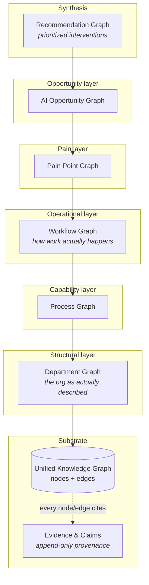
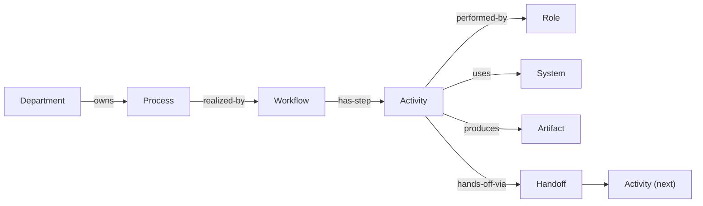
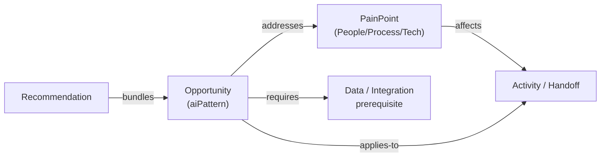
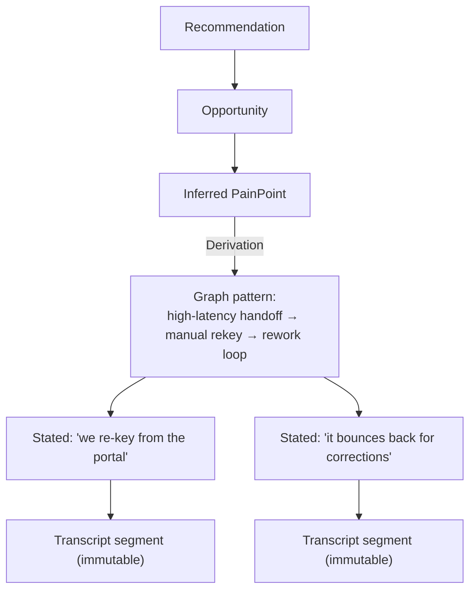
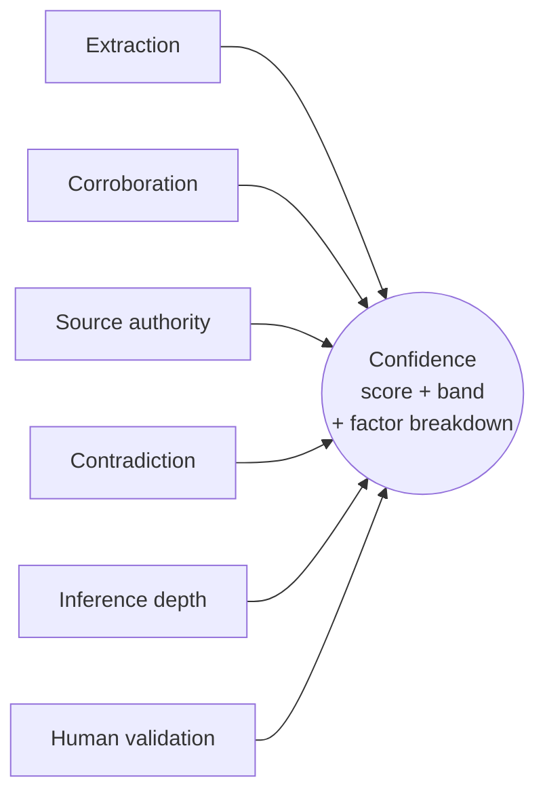
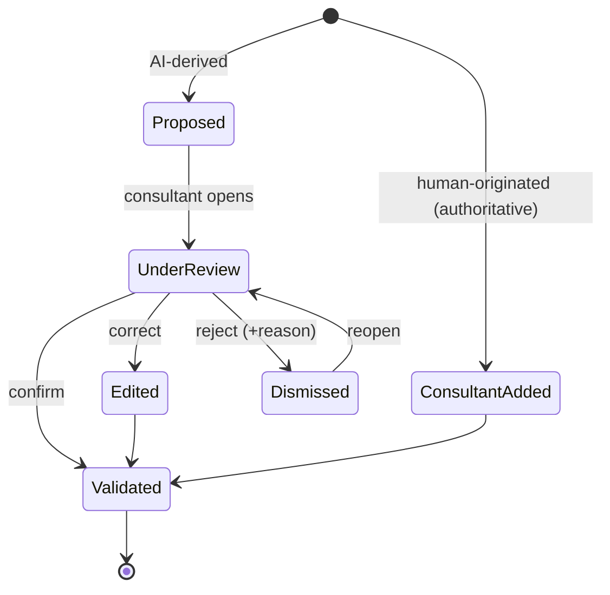
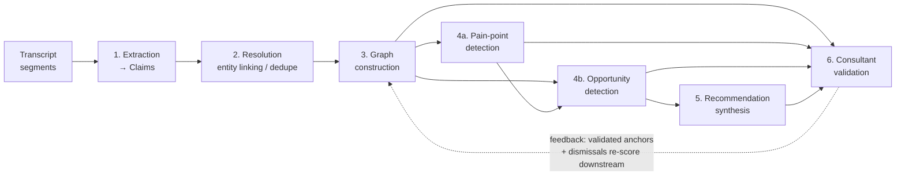

# The Organizational Intelligence Engine

> **Status:** Design. Domain model, entities, relationships, data flow, and
> reasoning pipeline. **No implementation.** This document defines *what the
> knowledge is and how it is reasoned about*, ahead of any storage or framework
> choice. Decisions here are ratified via `docs/adr/` (see `0004`).

This is the competitive core of the platform. The interview is the ingestion
layer; **this engine is the product.** It converts raw interview transcripts into
a structured, evidence-backed, consultant-validatable model of how an
organization actually works.

---

## 0. The central thesis: one graph, many lenses

The six graphs you named — Knowledge, Department, Process, Workflow, Pain Point,
AI Opportunity — are **not six separate stores.** They are **typed layers over a
single unified property graph.** A "Department Graph" is a *query* — the
structural nodes and edges of the one graph. A "Pain Point Graph" is another
lens over the same substrate, one that also links *into* the workflow and
department layers.

Why this matters (and why separate stores would be a mistake):

- **Cross-layer reasoning is the whole point.** "This *bottleneck* (pain layer)
  occurs at this *handoff* (workflow layer) between two *departments*
  (structural layer), and is addressable by this *opportunity* (opportunity
  layer)." That sentence is a path through one graph. In six separate stores it
  is an integration nightmare.
- **Provenance stays unified.** Every node and edge in every layer traces to the
  same evidence substrate. Split the stores and you split the evidence.
- **Layers are cheap to add.** A new lens (e.g. a "Data Readiness Graph" later)
  is a new node/edge *type*, not a new database.

The **Knowledge Graph** is the whole substrate. The other five are semantic
layers built on top of it, each depending on the layers below.

---

## 1. Scope: what the graph belongs to

| Concept | Role |
|---|---|
| **Organization (Tenant)** | The client company. Owns all engagements. Tenant-isolation boundary (per ADR-0003). |
| **Engagement** | One Discovery & Assessment project for that org, bounded in time. **The graph is scoped to an engagement.** This is what a consultant works within. |
| **Knowledge Graph** | The living organizational model *for one engagement*. Grows as interviews are ingested; versioned as it is recomputed. |

Scoping the graph to an **Engagement** (not permanently to the Org) is
deliberate: a discovery has a point-in-time snapshot quality, engagements can be
re-run as the org evolves, and it keeps the analysis boundary crisp. A future
"how did this org change between engagements" capability compares two graphs —
it does not require one eternal mutable graph. *(This is an open decision flagged
in §11; the alternative is a continuously-living org graph with engagement
overlays.)*

> **A recurring, high-value signal:** the graph captures how the organization
> **actually** works (as described by the people doing the work), which routinely
> **diverges from the official org chart and documented processes.** That
> divergence is itself an insight, not noise to be smoothed away.

---

## 2. The substrate: nodes, edges, and the two things every one of them carries

The entire model reduces to two base entities plus two mandatory cross-cutting
value objects.

### `KnowledgeNode` (abstract base)

| Field | Meaning |
|---|---|
| `id`, `tenantId`, `engagementId` | Identity + scope. |
| `type` | Which node kind (see layer catalogs below). Determines its layer(s). |
| `label` | Canonical, resolved name ("Finance Department"). |
| `attributes` | Type-specific structured payload (see per-type tables). |
| `evidence[]` | **Provenance — mandatory, ≥1.** Why we believe this node exists. |
| `confidence` | Computed, explainable `Confidence` value object (§7). |
| `validation` | `ValidationStatus` — the consultant-in-the-loop state (§9). |
| `version`, timestamps | The graph is versioned; evidence is append-only. |

### `KnowledgeEdge` (abstract base)

Edges are **first-class and evidence-bearing** — a relationship is a claim about
the world just as much as a node is.

| Field | Meaning |
|---|---|
| `id`, `tenantId`, `engagementId` | Identity + scope. |
| `type` | The predicate (`owns`, `hands-off-to`, `addresses`, …). |
| `sourceNodeId`, `targetNodeId` | Endpoints. |
| `attributes` | Predicate-specific payload (e.g. a handoff's latency). |
| `evidence[]`, `confidence`, `validation` | Same three cross-cutting concerns as nodes. |

> **Invariant:** no node and no edge exists without `evidence`, `confidence`, and
> `validation`. These are not optional metadata; they are the reason the platform
> is trustworthy to a consultant.

---

## 3. Layer 1 — Department Graph (structural)

*How the organization is actually structured, as described by its people.*

**Nodes**

| Type | Key attributes |
|---|---|
| `Department` | name, function, size (as described), stated mandate |
| `Team` | name, parent department |
| `Role` | title, seniority, headcount (as described) |
| `Person` | *interviewee reference only* — pseudonymized; links a viewpoint to evidence, never a surveillance record |

**Edges**: `reports-to` (Role→Role, Team→Dept), `part-of` (Team→Dept),
`holds-role` (Person→Role), `collaborates-with` (Dept↔Dept, evidences informal
structure).

This layer is the **skeleton** every other layer hangs from. Structural nodes are
the anchors entity-resolution (§6, Stage 2) merges toward.

---

## 4. Layer 2 — Process Graph (capability)

*What the organization does, at the level of business capabilities.*

**Nodes**

| Type | Key attributes |
|---|---|
| `Process` | name, purpose, trigger, cadence, criticality |
| `Capability` | a business capability a process delivers |

**Edges**: `owns` (Department→Process), `composed-of` (Process→Process /
sub-process), `depends-on` (Process→Process), `delivers` (Process→Capability).

The Process Graph is the bridge between *who* (departments) and *how* (workflows).
It answers "what does Finance actually do" before we descend into the step-level
detail of *how* they do it.

---

## 5. Layer 3 — Workflow Graph (operational)

*The step-by-step reality of how work gets done. This is where automation
opportunities and bottlenecks physically live.*

**Nodes**

| Type | Key attributes |
|---|---|
| `Workflow` | name, the `Process` it realizes, frequency, trigger, end-state |
| `Activity` (step) | name, actor `Role`, effort/duration, frequency, **manual vs. system-assisted vs. automated**, rework rate |
| `Handoff` | from-actor, to-actor, artifact exchanged, channel (email/meeting/system/none), latency, **queue/wait time** |
| `System` | tool/application used, integration quality (as described), swivel-chair flag |
| `Artifact` | an input/output — document, spreadsheet, ticket, dataset |

**Edges**: `realized-by` (Process→Workflow), `has-step` (Workflow→Activity),
`precedes` (Activity→Activity, incl. loops = rework), `performed-by`
(Activity→Role), `uses` (Activity→System), `consumes`/`produces`
(Activity↔Artifact), `hands-off-via` (Activity→Handoff→Activity).

> **Why handoffs and artifacts are modeled explicitly:** bottlenecks and AI
> opportunities cluster at **handoffs** (wait time, re-keying, lost context) and
> at **artifacts** (manual document processing, spreadsheet swivel-chair work).
> Making them first-class nodes means detectors can find them structurally, not
> just from someone complaining out loud.

---

## 6. Layer 4 — Pain Point Graph (diagnostic)

*Where it hurts — and whether the cause is people, process, or technology.*

**Node**

| Type | Key attributes |
|---|---|
| `PainPoint` | description, **category = {People \| Process \| Technology}**, severity, frequency, whoAffected, **symptom-vs-root-cause**, **stated-vs-inferred** |

**Edges**: `affects` (PainPoint→Activity/Handoff/Workflow/Department),
`caused-by` (PainPoint→Activity/System/Handoff/other PainPoint — enables
root-cause chains), `blocks` (PainPoint→Process/Workflow),
`corroborated-by`/`contradicted-by` (PainPoint↔Evidence).

Two provenance kinds feed this layer, and the model distinguishes them:

- **Stated pain** — someone said "reconciliation takes three days because
  finance re-keys everything from the portal." Evidence = the segment.
- **Inferred pain** — a detector finds a workflow with a high-latency handoff
  feeding a manual re-keying activity with a loop-back (rework) edge, and no one
  named it out loud. Evidence = the **graph pattern plus the stated facts that
  built it** (see the Evidence Model, §8 — inferred evidence resolves
  transitively to stated segments).

The People/Process/Technology classification directly serves the consulting
question *"which problems are caused by people, process, or technology?"* — it is
a modeled attribute, not a post-hoc tag.

---

## 7. Layer 5 — AI Opportunity Graph

*Where AI/automation can help, tied to the pain it resolves and the work it
touches.*

**Node**

| Type | Key attributes |
|---|---|
| `Opportunity` | description, **`aiPattern`** (from a taxonomy: document-extraction, classification, drafting/generation, routing/triage, forecasting, retrieval/Q&A, RPA/rules, anomaly-detection…), targetActivity/Workflow, expected impact, **prerequisites** (data availability, integration, volume), feasibility, risk |

**Edges**: `addresses` (Opportunity→PainPoint), `applies-to`
(Opportunity→Activity/Workflow/Handoff), `enabled-by`
(Opportunity→Capability/System), `requires` (Opportunity→prerequisite data/
integration), `conflicts-with`/`depends-on` (Opportunity↔Opportunity).

An Opportunity is only credible when it can name **both** the pain it addresses
**and** the concrete workflow step it applies to. An opportunity with no
`addresses` edge and no `applies-to` edge is a floating suggestion — the model
makes that structurally visible (and low-confidence).

---

## 8. Synthesis — the Recommendation Engine

*Not a seventh graph of atomic facts; a synthesis layer that turns opportunities
into prioritized, consultant-ready interventions.*

A single Opportunity ("auto-extract invoice fields") is rarely a recommendation
on its own. The Recommendation Engine **bundles** related opportunities that share
a workflow, department, or capability into a coherent intervention, then
**prioritizes** it.

**Node**

| Type | Key attributes |
|---|---|
| `Recommendation` | title, narrative, bundled opportunities, **priority score**, **horizon** (quick-win / near-term / strategic), impact / effort / feasibility, risks, dependencies, owning department |

**Edges**: `bundles` (Recommendation→Opportunity[]), `targets`
(Recommendation→Department/Process), `depends-on` (Recommendation↔Recommendation,
sequencing), `sourced-from` (transitively → opportunities → pain → workflow →
evidence).

**Prioritization is a domain policy, not a hardcoded formula.** The engine
computes a ranking from **impact × feasibility ÷ effort**, modulated by
confidence and by strategic weight the consultant can set. Because it is a policy
object (Strategy pattern), a firm can tune "we favor quick wins this quarter"
without touching the model.

Crucially, a Recommendation carries its **full provenance chain**: recommendation
→ opportunities → pain points → workflow steps → **transcript segments.** A
consultant can drill from a boardroom-level recommendation all the way down to
the sentence an employee said. That drill-path is the product's credibility.

---

## 9. Cross-cutting: the Evidence Model

Evidence is the spine of the whole engine. **Every node, edge, pain point,
opportunity, and recommendation links to evidence — always, by invariant.**

### `EvidenceRef` (immutable pointer)
`{ transcriptId, segmentId, charStart, charEnd, speakerRef, timestamp }` — points
at an exact, immutable span of an append-only transcript.

### `Evidence` (a piece of provenance)

| Field | Meaning |
|---|---|
| `kind` | `Stated` \| `Corroborated` \| `Inferred` \| `ConsultantAsserted` |
| `ref` | An `EvidenceRef` (for stated) **or** a `Derivation` (for inferred) |
| `source` | Whose perspective: `{ personRef, role, department }` — **perspective-aware** |
| `speakerCertainty`, `sentiment` | How strongly / how the source expressed it |
| `method` | For extracted evidence: `{ model, version, promptRef }` — reproducibility |
| `createdAt` | Append-only. |

### `Derivation` (how inferred evidence resolves)
`{ detectorId, inputEvidence[], graphPattern, explanation }`. This is what makes
**inferred insights auditable**: an inferred pain point's `Derivation` names the
rule that fired and the input evidence, and each input evidence either is stated
(has an `EvidenceRef`) or has its own `Derivation`. Follow the chain and every
inference **bottoms out in stated transcript segments.**

**Perspective and disagreement are first-class.** Two departments describing the
same handoff differently do not "conflict and one loses" — both viewpoints are
retained as evidence on the edge, and the disagreement is itself a signal (often
a bottleneck marker). The model never silently picks a winner.

---

## 10. Cross-cutting: Confidence Scoring

Confidence is **not** a number an LLM emits. It is a **computed, explainable
value object** produced by a `ConfidencePolicy` (a domain service), and it is
**orthogonal to validation status** — AI-confidence and human-verification are two
different axes.

### `Confidence` value object

| Field | Meaning |
|---|---|
| `score` | 0..1 scalar, for ranking. |
| `band` | `Low` \| `Medium` \| `High`, for UI. |
| `factors` | The explainable decomposition (below). |
| `rationale` | Human-readable "why this score". |

### The factors

| Factor | Effect |
|---|---|
| **Extraction confidence** | How sure the extractor was of the raw claim. |
| **Corroboration** | Independent sources agreeing ↑. More, and more independent, is stronger. |
| **Source authority** | A dept head describing *their own* workflow ↑; someone describing another team's ↓. Role-weighted. |
| **Contradiction** | Conflicting evidence ↓ — and flags the artifact for review. |
| **Inference depth** | Deeper derivation chains decay confidence; stated facts start higher than inferred. |
| **Human validation** | Consultant confirmation anchors confidence (overrides the computed score). |

Two design consequences:

- **Confidence is explainable in the UI.** A consultant sees *why* something is
  "Medium," not just that it is. That is what earns trust.
- **Confidence and validation never collapse into one field.** A fact can be
  high-confidence-but-unvalidated (strong AI signal, no human has looked) or
  low-confidence-but-validated (weak signal a consultant nonetheless confirmed
  from outside knowledge). The model keeps both.

---

## 11. Cross-cutting: the Consultant Validation Workflow

**The AI proposes; the consultant disposes.** The platform never presents machine
inference as established fact. Every artifact carries a validation lifecycle, and
the graph effectively has **two provenance planes** — machine-derived and
human-verified.

### `ValidationStatus` state machine

- **Granularity:** validation applies to a single node/edge, a whole subgraph
  (e.g. "confirm this entire workflow"), an insight, or a recommendation — with
  bulk actions.
- **Edit preserves the original.** An `Edited` artifact creates a
  consultant-corrected version; the AI's original is retained for audit and
  learning. Nothing the AI produced is destroyed by a human correction.
- **Every transition is audited.** `ValidationEvent { actor, action, reason,
  before, after, timestamp }`.
- **Validation feeds back.** Validated artifacts become **high-confidence anchors**
  that the pipeline (§12) must not overwrite on recompute; dismissing a pain
  point re-scores or removes the opportunities that depended on it. Human
  judgment propagates.

---

## 12. The reasoning pipeline (data flow)

The engine is a sequence of **transformation stages**, each with a clear
input→output contract, each **idempotent and re-runnable**, and each **protecting
human-validated anchors** from being clobbered on recompute. The stages map
directly onto the `ai-engine` capabilities and `core-api` contexts defined in
`ARCHITECTURE.md`.

| Stage | Input → Output | Owner |
|---|---|---|
| **0. Ingestion** | Interview → immutable, segmented `Transcript` | `core-api` · Transcript |
| **1. Extraction** | Segment → `Claim[]` (atomic subject-predicate-object assertions, each with an `EvidenceRef` + extraction confidence, typed by target layer) | `ai-engine` · Extraction |
| **2. Resolution** | `Claim[]` → resolved entities (coreference + entity linking; "finance", "the finance team", "Finance Dept" → one node). Merging **combines evidence and recomputes confidence** (corroboration). | `ai-engine` · Knowledge construction |
| **3. Graph construction** | Resolved claims → typed nodes & edges promoted into the layered graph; contradictions recorded, not hidden. | `ai-engine` · Knowledge construction → persisted by `core-api` · Knowledge |
| **4a. Pain-point detection** | Graph → `PainPoint` nodes (stated + structurally inferred), classified People/Process/Tech, with evidence. | `ai-engine` · Bottleneck detection |
| **4b. Opportunity detection** | Graph + pain points → `Opportunity` nodes matched against the AI-pattern taxonomy, each with `addresses` + `applies-to` links. | `ai-engine` · Opportunity detection |
| **5. Recommendation synthesis** | Opportunities → bundled, prioritized `Recommendation`s with full provenance chains. | `ai-engine` · (recommendation capability) → persisted by `core-api` · Reporting/Insights |
| **6. Validation** | Any artifact → validated / edited / dismissed; audited; anchors fed back. | `core-api` · Insights + Consultant Workspace (human-driven) |

### The `Claim` — the atomic bridge

The pipeline's key intermediate entity is the **`Claim`**: the atomic unit that
bridges unstructured text and structured graph.

`Claim { id, engagementId, subjectPhrase, predicate, objectPhrase, targetLayer,
evidence (the segment), extractionConfidence, status: unresolved | resolved(→
node/edge ids) | rejected }`

Claims keep extraction (fuzzy, text-level) cleanly separated from graph
construction (structured, resolved). Re-running extraction with a better model
produces new claims without destabilizing the validated graph above them.

### Re-runnability and the protection of human work

Because interviews arrive incrementally and models improve, **every stage must be
safely re-runnable.** The governing rule: **recomputation may revise
machine-derived, unvalidated artifacts, but must treat consultant-validated
artifacts as immutable anchors** — re-scoring around them, never over them. This
is what lets the graph keep learning from new interviews without ever discarding
a consultant's confirmed judgment.

---

## 13. Domain model summary

**Aggregates / entities**

- `Engagement` (scope + lifecycle) → one `KnowledgeGraph`
- `KnowledgeNode` (abstract) → Department, Team, Role, Person · Process,
  Capability · Workflow, Activity, Handoff, System, Artifact · PainPoint ·
  Opportunity · Recommendation
- `KnowledgeEdge` (abstract, evidence-bearing) → the typed predicates per layer
- `Claim` (pipeline intermediate)

**Cross-cutting value objects (on every node & edge)**

- `Evidence` / `EvidenceRef` / `Derivation` — provenance (mandatory)
- `Confidence` (+ factors) — explainable, computed, orthogonal to validation
- `ValidationStatus` (+ `ValidationEvent`) — the human-in-the-loop plane

**Consistency boundaries:** the individual node/edge is the transactional
aggregate; graph-wide operations are eventually consistent (the graph is too
large to be one in-memory aggregate). Evidence is append-only; the graph is
versioned.

**Non-negotiable invariants**

1. No node/edge without evidence, confidence, and validation.
2. Every inferred insight resolves transitively to stated transcript segments.
3. AI output is `Proposed`, never `fact`, until a consultant disposes.
4. Recomputation never overwrites a validated anchor.

---

## 14. How it maps to the existing architecture

Nothing here contradicts `ARCHITECTURE.md`; it fills in the Knowledge, Insights,
Reporting contexts and the `ai-engine` capabilities:

- **`ai-engine` capabilities** own stages 1–5 (pure cognition; emit structured,
  evidence-bearing output; own no truth).
- **`core-api` · Knowledge** owns the persisted graph and enforces the
  invariants and tenant scoping.
- **`core-api` · Insights** owns pain points, opportunities, and the validation
  lifecycle.
- **`core-api` · Reporting** consumes validated recommendations.
- **`packages/contracts`** carries `Claim`, node/edge, `Evidence`, `Confidence`,
  and `Recommendation` shapes across the runtime boundary — with the evidence
  invariant enforced *at the contract*, so `ai-engine` cannot emit an
  evidence-less artifact.

---

## 15. Deliberately open (needs a decision before build)

1. **Graph scope — engagement-snapshot vs. continuously-living org graph.** This
   doc assumes engagement-scoped (§1); the alternative changes versioning and
   cross-engagement comparison. *Recommend engagement-scoped.*
2. **Graph storage model.** Native graph DB vs. relational-with-graph-semantics
   vs. document. Behind a port either way (per ADR-0002); pick when we build the
   Knowledge context, not now.
3. **AI-pattern taxonomy ownership.** Is the opportunity taxonomy a fixed
   domain-owned catalog, or consultant-extensible per firm? *Recommend
   domain-owned v1, extensible later.*
4. **Recommendation prioritization policy.** Default `impact × feasibility ÷
   effort`; confirm the firm's weighting model and whether it is
   consultant-tunable per engagement.
5. **Learning loop.** Do consultant validations/dismissals feed back into
   extractor/detector improvement (a labeled dataset), or only into the live
   graph? Has data-governance implications worth an explicit ADR.
